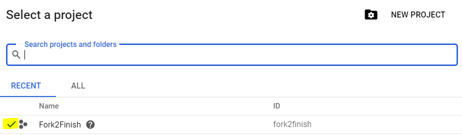
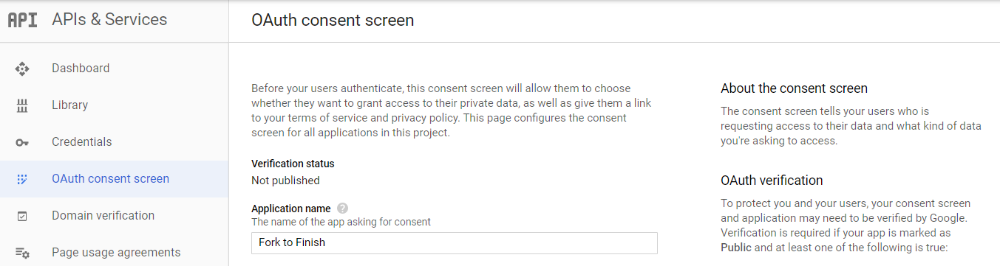
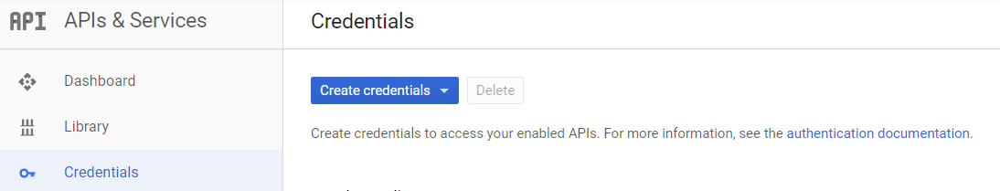

# Fork-to-Finish
From start to finish - a starter kit for an MVC style MERN project, including an example of auth with Open Id!

Tired of hunting through a labrynthian server.js file looking for what you named your api routes?  Trying to make sure your business logic is properly applied to every database interaction? Check out 'fork to finish' -- a MERN stack starter kit designed to strongly separate concerns. This MVC layout is intended to make it easier for teams to zero in on the code they need to work on. Additionally, this project includes several standard recommendations from [the Open Web Application Security Project](https://www.owasp.org/index.php/Main_Page) to help prevent some common vulnerabilites.

## Installation Steps for the Example
1) Fork this repository and clone it to your machine
2) Create a Google project and basic oAuth credentials. Step-by-step instructions are provided in [the below addendum](#google).
3) Ensure you have (MongoDB)[https://www.mongodb.com/download-center/community] installed and running on your local machine. 
4) Ensure you have (Redis)[https://redis.io/] installed and running on your local machine. 
    * Windows users can substitute the technical preview edition of [Memurai](https://www.memurai.com/)
3) Generate a cryptographically strong string for your cookie secret ([see Node.js crypto for one option](https://nodejs.org/api/crypto.html#crypto_crypto_randombytes_size_callback) )
4) In the 'config' directory, follow the format shown in 'config/example.js' to create your own local configuration file. This file should be named 'config/development.js'.
    * ```hostname```: name of the host the server is running on
    * ```port```: which port to use (default: 4000)
    * ```databaseRef```: mongo URI to your local db
    * ```google_client_id```: your google client id
    * ```google_client_secret```: your google client secret
    * ```cookie_secret```: a cryptographically strong secret for use with your session cookie
4) Run the project using ```npm start```    

## Architecture Overview


1. **Client:**
    Contains all code for the front-end application. Example application is based on the create-react-app boilerplate.
    * **Src:** React source files
    * **Public:** Static directory
        * Static images go here
        * Favicons go here
2. **Config:**
    Contains configurations for each named environment (default: "development"). Config files must be named after the environment (ex: "development.js").
    * **index.js:** dynamically reads in the appropriate config file based on the environment name set in pprocess.env.NODE_ENV
3. **Database:**
    Contains all schemas, services, and connection setup for persistent database storage. 
    * **Schema:** ORM/ODM schema definitions (if using)
    * **Services:** Abstration layer to handle database interactions. Business logic should be incorporated here.
    * **index.js:** -- Sets up and exports a connection to the database based on the Mongo URI from the current configuration (```databaseRef```)
4. **Server:**
    Contains all code for an Express.js application, including route handlers, error handlers, and authentication middleware.
    * **Auth:** Passport.js auth strategies
    * **Controllers:** Reusable route handlers (that may or may not interact with db services)
    * **Middleware:** Reusable middleware
        * **Auth:** Middleware to check if a user is authenticated before moving on
        * **Errorhandlers:** Custom error handling middleware
    * **Routes:** 
    Contains Express route definitions (using [Express router](http://expressjs.com/en/5x/api.html#router))

## Common Areas to Customize
### 1. Authentication / Authorization Stratgies
Authentication in this project is handled by the popular [passport.js middleware](http://www.passportjs.org/), which supports multiple identity providers such as [Google, Facebook, Twitter, and many more](http://www.passportjs.org/packages/). For example purposes, this project uses Google's Open Id strategy. 

* To add new authentication strategies, create new files within the ```server/auth``` directory. Each file should export a function that takes one argument (a config object) and returns a configured Passport Strategy. (See the file ```server/auth/google-strategy.js``` for an example.)
* When a user successfully authenticates via any method, the project will issue them a session cookie. Upon each subsequent request, passport will check if the session is still valid and then look up their current db record via a shared serialize / deserialize methods. To customize this behavior, modify the code in the serialize / deserialize sections of ```server/auth/index.js```. 

### 2. Session storage
In order to keep track of which user is current logged in, the project issues a session cookie via [express-session](https://www.npmjs.com/package/express-session). To manage session information, express-session requires a storage solution. This project uses Redis, but there are [many compatible options](https://www.npmjs.com/package/express-session#compatible-session-stores). 

* To change which storage option your project is using, identify a [compatible store](https://www.npmjs.com/package/express-session#compatible-session-stores) and install it.
* Edit the "Session storage setup" section of ```server/index.js```

### 3. Custom Error Handling for Routes
Express.js has a barebones built-in error handler which returns a statusCode 500 for any untrapped synchronous errors. To provide a better user experience, this project includes a custom error handler for db validation errors.

* To define custom error handlers, add new files within ```server/middleware/errorhandlers```. These files should each export a function with four parameters (err, req, res, next). 
* Ensure your new file is imported into ```server/middleware/errorhandlers``` and exported in the preferred execution order

## 


## Addendum: Setting up a Google project with credentials for Open Id Connect
<a name="#google">This project uses Google's Open Id Connect service to authenticate users.</a> Website visitors who have an existing google account can use those credentials to authenticate themselves without ever passing any sensitive information (such as password) through this project. In order to use this auth strategy for your own project, you will need to register your application with Google as follows:

1. Register for a developer account at [https://console.developers.google.com/].
2. Log in and create a new project. 
3. Next, ensure to double-check that your new project shows as selected in the project list. (If not, click on the project's name until a checkmark appears.)
    
4. Select "OAuth consent screen" from the dashboard menu.
    
5. **Take care while filling out this consent screen!** Per the notes on the right-hand side of the page, if your application requires extra permissions or uses a custom icon, it will need vetting (which can take multiple days). If you are simply interested in trying out the functionality asap, you should fill out the following options:
    * **Application Name**: The name of your application
    * **DO NOT PROVIDE A CUSTOM ICON** 
    * **Support email:** List your email (or pick a Google Group that you control)
    * **Scopes for Google API:** Leave as-is ('email profile open id')
    * **Authorized domain:** A domain where you will host your privacy policy/TOS. You can use github.com (or the domain for your personal site) if you have not yet secured hosting for an application.
    * **Homepage Link / Privacy Policy / Terms of Service Links:** Same as above. If you are in development, recommend that you host this information on GitHub.
6. Select "Credentials" from the dashboard menu.
    
7. Select "Create Credentials" => OAuth Client ID
8. Select "Web Application"
9. Once you have created a Client Id and Secret, **KEEP THIS INFORMATION PRIVATE!** This info should never be committed to GitHub, shared wth pals, etc. For the purposes of this demo project, the client id and secret will be stored in a local config file.